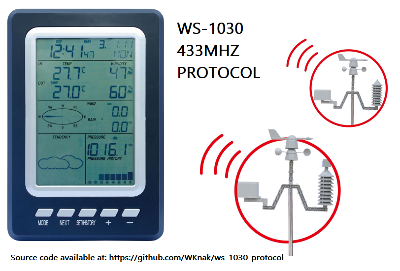

# WS-1030 Protocol

## Weather Station ws1030 Protocol

Arduino code to read WS-1030 data transmitted over 433mhz frequency

This is a study to capture WS-1030 data trasnmitter over 433mhz frequency

Since I don't have an osciloscope, all protocol was discovered making experiments, delays, and so on

Weather Station manual or manufacturer don't provide protocol

I also included an BM180 sensor for internal temperature and pressure values, this is optional

Sample protocol

```
START	     ID1       ID2              DIR 	 TEMP 9BITS   HUM    WIND AVG   GUST     ??               rain  				        CHKSUM
11110101 10110101 11111010 00000000 0000000 1 00101111 00110101 00000000 00000001 00000000 0000010 1 11011000 11100111 00110000
11110101 10110101 11111010 00000000 0000000 1 00101111 00110101 00000000 00000001 00000000 0000010 1 11011000 11100111 00110000
11110101 10110101 11111010 00000000 0000000 1 00101111 00110101 00000000 00000001 00000000 0000010 1 11011000 11100111 00110000
11110101 10110101 11111010 00000000 0000000 1 00101111 00110101 00000000 00000001 00000000 0000010 1 11011000 11100111 00110000
11110101 10110101 11111010 00000000 1110000 1 00101111 00110101 00000000 00000001 00000000 0000010 1 11011000 11000111 01011100
11110101 10110101 11111010 00000000 1110000 1 00101111 00110101 00000000 00000010 00000000 0000010 1 11011000 11001000 00110110
```



